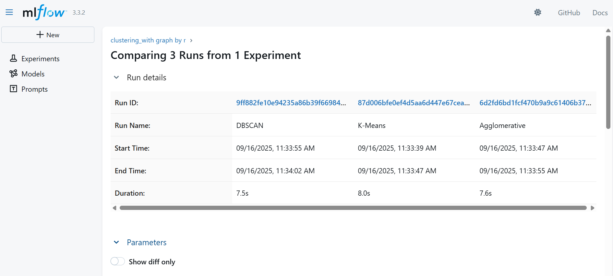
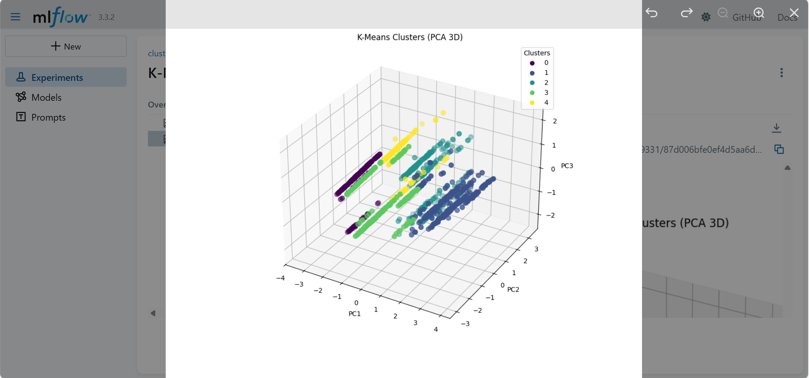

# Clustering Prediction App with MLflow and Gradio

## 🚀 Overview

This project implements an easy-to-use web app that predicts clusters
using three clustering algorithms: - KMeans - Agglomerative Clustering -
DBSCAN

It provides: - Scaled input features - Cluster predictions -
Visualization of clusters in 2D and 3D\
- MLflow tracking for input parameters and predicted clusters

The app is built with **Gradio** and uses **pretrained models and
scaler** for fast predictions without retraining.

------------------------------------------------------------------------

## ⚙️ Features

-   Predict clusters based on user input features
-   Static 2D and 3D PCA visualization of clusters
-   Logs input and prediction data to MLflow
-   Simple web interface powered by Gradio
-   Pretrained models for instant prediction

------------------------------------------------------------------------

## ✅ How to Run

1.  Install dependencies: `bash     pip install -r requirements.txt`

2.  Make sure the following files are present in the same folder as
    `app.py`:

    -   `scaler.pkl`
    -   `KMeans_model.pkl`
    -   `Agglomerative_model.pkl`
    -   `DBSCAN_model.pkl`
    -   `df_pca_2d.pkl`
    -   `df_pca_3d.pkl`

3.  Run the application: `bash     python app.py`

4.  Open the local URL provided by Gradio in your browser.

------------------------------------------------------------------------

## 📚 Input Features

  Feature           Description
  ----------------- ---------------
  Sex               Numeric value
  Marital Status    Numeric value
  Age               Numeric value
  Education         Numeric value
  Income            Numeric value
  Occupation        Numeric value
  Settlement Size   Numeric value

------------------------------------------------------------------------

## 📊 Output

-   JSON object showing cluster labels predicted by:
    -   KMeans
    -   Agglomerative
    -   DBSCAN
-   Static plots (2D & 3D PCA) are saved during prediction for analysis.

------------------------------------------------------------------------

## ✅ MLflow Tracking

Each prediction run logs: - Input feature values - Predicted clusters
for all models

Access MLflow UI via:

``` bash
mlflow ui
```



------------------------------------------------------------------------

## ⚡️ Notes

-   Ensure all `.pkl` files are created by running the notebook before
    running `app.py`.
-   Static plots avoid interactive visualization issues.

------------------------------------------------------------------------

## 🧱 Tech Stack

-   Python\
-   scikit-learn\
-   Gradio\
-   MLflow\
-   joblib\
-   Matplotlib
